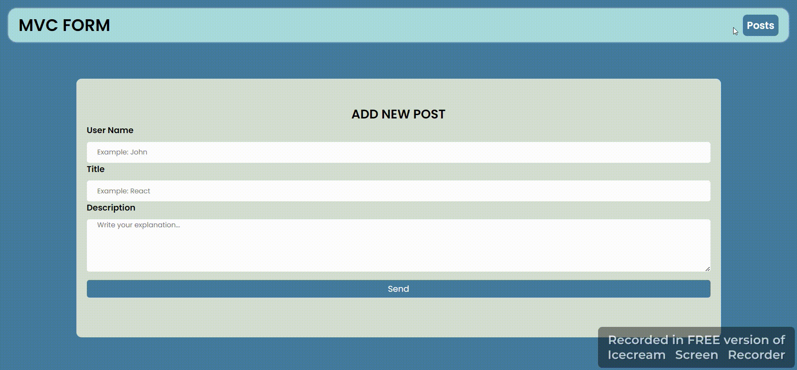

# MVC form 

<h1>This project is a simple mail sending application that I created using Model-View-Controller (MVC) architecture and you can add a new user and view or control the message contents.</h1>

# Libraires
- json-server
- axios
- uuid
- react-router-dom

Screen View

